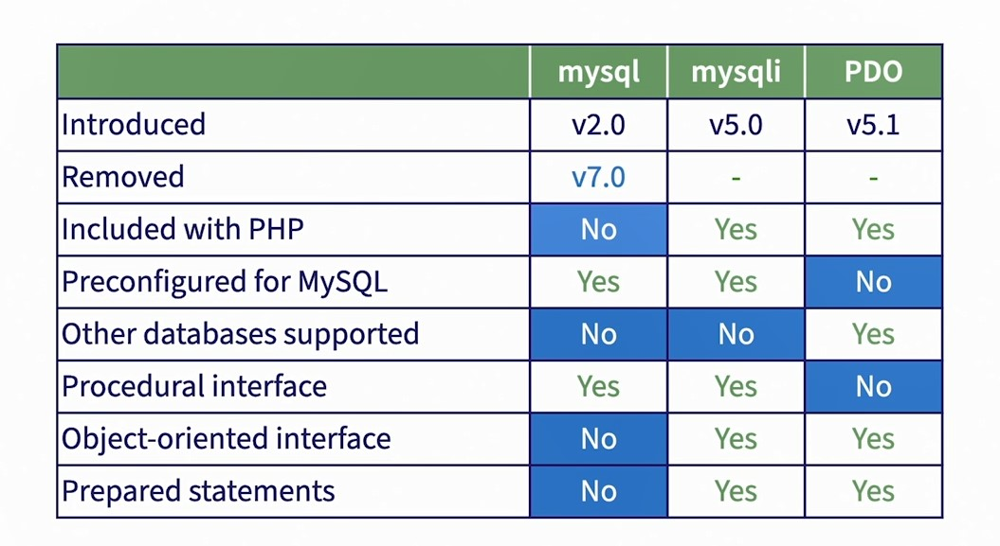

## 25. Создание БД в командной строке

    mysql --version

    mysql -u root
    (mysql -u root -p)

    ->Welcome...

    mysql>

Основные команды

    SHOW DATABASES;
    CREATE DATABASE db_name;
    USE db_name;
    DROP DATABASE db_name;

Создание пользователя, чтобы не использовать root

    GRANT ALL PRIVILEGES ON db_name.* TO 'webuser'@'localhost' IDENTIFIED BY 'secretpassword';

    SHOW GRANTS FOR 'webuser'@'localhost';

## 026-Create a database table

```sql
    SHOW TABLES;
    SHOW COLUMNS FROM table_name;
    DROP TABLE table_name;
```

```sql
CREATE TABLE subjects (
  id INT(11) NOT NULL AUTO_INCREMENT,
  menu_name VARCHAR(255),
  position INT(3),
  visible TINYINT(1),
  PRIMARY KEY (id)
);
```

## 027-CRUD in MySQL

```sql
SELECT *
FROM table
WHERE columnn1 = 'some_text'
ORDER BY column1 ASC;

INSERT INTO table (col1, col2, col3)
VALUES (val1, val2, val3);

UPDATE table
SET col1 = 'this', col2 = 'that'
WHERE id = 1;

DELETE FROM table
WHERE id = 1
LIMIT 1;  -- не обязательный лимит, но хорошая практика

```

## 028-Populate a MySQL table

    INSERT INTO subjects (id, menu_name, position, visible) VALUES (1, 'About Globe Bank', 1, 1) ;

    INSERT INTO subjects (menu_name, position, visible) VALUES ('Consumer', 2, 1) ;

    INSERT INTO subjects (menu_name, position, visible) VALUES ('Small Business', 3, 1) ;

    UPDATE subjects SET visible='0' WHERE id=3 ;

## 029-Relational database tables

К столбцам, которые будут внешними ключами, добавляют индекс для быстрого поиска.  

    ALTER TABLE table
    ADD INDEX index_name (column);

## 030-Challenge Pages table

## 031-Solution Pages table

```sql
CREATE TABLE pages (
  id INT(11) NOT NULL AUTO_INCREMENT,
  subject_id INT(11),
  menu_name VARCHAR(255),
  position INT(3),
  visible TINYINT(1),
  content TEXT,
  PRIMARY KEY (id)
);

ALTER TABLE pages ADD INDEX fk_subject_id (subject_id);

INSERT INTO pages (subject_id, menu_name, position, visible) VALUES (1, 'Globe Bank', 1, 1);
INSERT INTO pages (subject_id, menu_name, position, visible) VALUES (1, 'History', 2, 1);
INSERT INTO pages (subject_id, menu_name, position, visible) VALUES (1, 'Leadership', 3, 1);
INSERT INTO pages (subject_id, menu_name, position, visible) VALUES (1, 'Contact Us', 4, 1);
INSERT INTO pages (subject_id, menu_name, position, visible) VALUES (2, 'Banking', 1, 1);
INSERT INTO pages (subject_id, menu_name, position, visible) VALUES (2, 'Credit Cards', 2, 1);
INSERT INTO pages (subject_id, menu_name, position, visible) VALUES (2, 'Mortgages', 3, 1);
INSERT INTO pages (subject_id, menu_name, position, visible) VALUES (3, 'Checking', 1, 1);
INSERT INTO pages (subject_id, menu_name, position, visible) VALUES (3, 'Loans', 2, 1);
INSERT INTO pages (subject_id, menu_name, position, visible) VALUES (3, 'Merchant Services', 3, 1);

SELECT * FROM pages;

SELECT * FROM pages WHERE subject_id=2;

SELECT * FROM pages WHERE subject_id=2 AND visible=1;

```

## 032-Database APIs in PHP

Три API для подключения к MySQL:

- mysql
- mysqli (i - improved)
- PDO (PHP data objects)

Разница между ними:



Схожесть процедурных и ООП функций:

```
Procedural

mysqli_connect 
mysqli_connect_errno 
mysqli_connect_error 
mysqli_real_escape_string
mysqli_query
mysqli_fetch_assoc
mysqli_close


Object Oriented

$mysqli = new mysqli 
$mysqli->connect_errno 
$mysqli->connect_error
$mysqli->real_escape_string
$mysqli->query
$mysqli->fetch_assoc 
$mysqli->close
```

Дополнительная информация:  

https://www.php.net/manual/ru/mysqlinfo.api.choosing.php

## 033-Connect to MySQL with PHP

PHP Database Interaction:


1. Create a database connection.
2. Perform a database query.
3. Use the returned data (if any).
4. Release the returned data.
5. Close the database connection.

1 и 5 шаги выполняются однократно во время исполнения скрипта. Остальные шаги могут выполняться многократно.    

Функции открытия и закрытия соединения с БД:  

```php
mysqli_connect($host, $user, $password, $database)
mysqli_close($connection)
```

db_connect_guide.php

```php
<?php

// This guide demonstrates the five fundamental steps
// of database interaction using PHP.

// Credentials
$dbhost = '';
$dbuser = '';
$dbpass = '';
$dbname = '';

// 1. Create a database connection
$connection = mysqli_connect($dbhost, $dbuser, $dbpass, $dbname);

// 2. Perform database query

// 3. Use returned data (if any)

// 4. Release returned data

// 5. Close database connection
mysqli_close($connection);

?>

```

##
